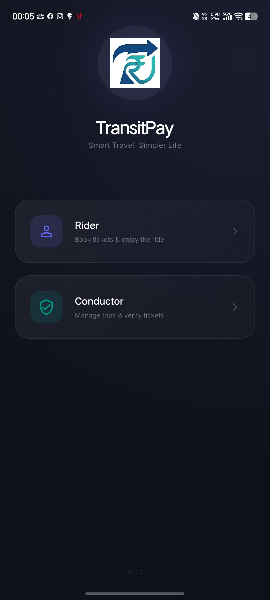
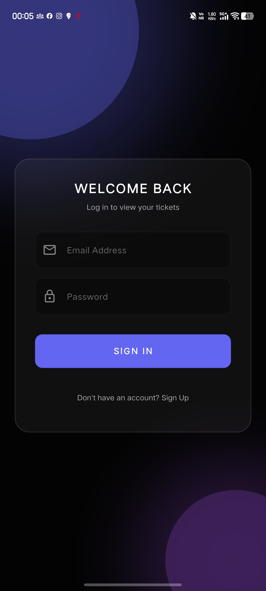
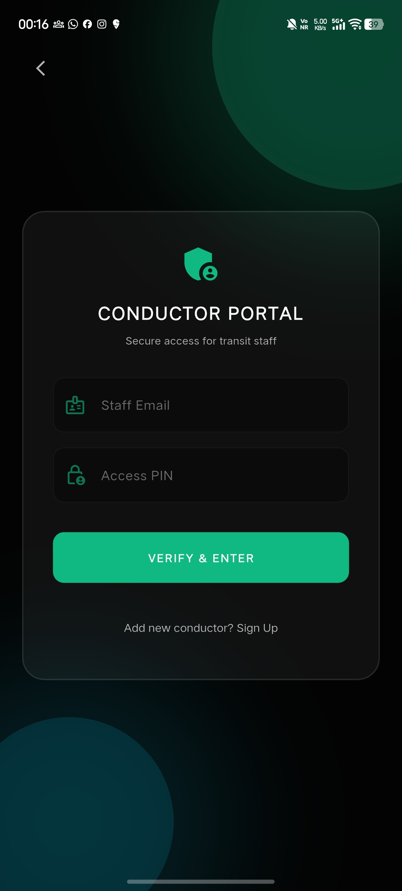
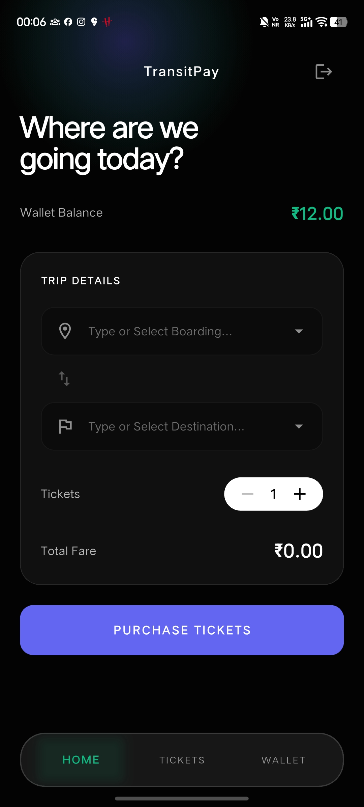
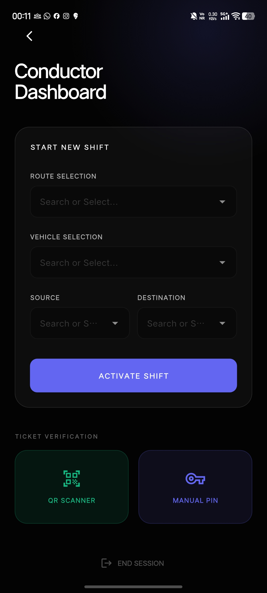
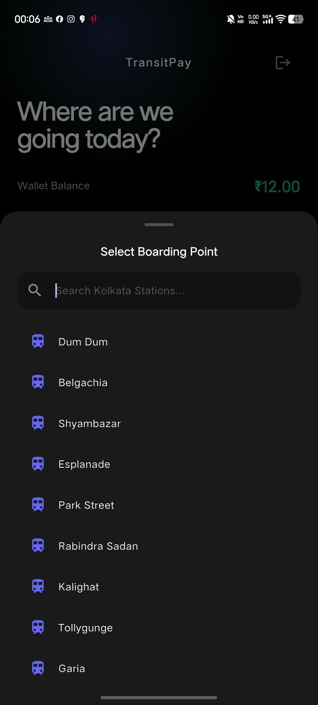
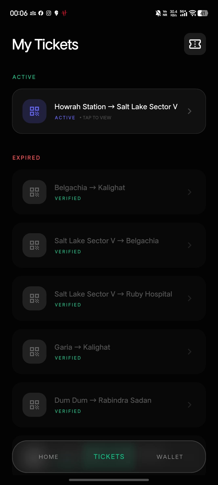

# 🚌 TransitPay - Smart Digital Transit Solutions


**TransitPay** is a high-performance, secure, and modern mobile ticketing platform designed to revolutionize public transportation. Built with Flutter and Supabase, it offers a seamless experience for both passengers and conductors.

---

## 📱 Visual Showcase

### 1. Welcome & Role Selection


### 2. Login: Rider & Conductor
| Rider Login | Conductor Login |
| :---: | :---: |
|  |  |

### 3. Dashboard: Rider & Conductor
| Rider Dashboard | Conductor Dashboard |
| :---: | :---: |
|  |  |

### 4. Boarding Points Selection


### 5. My Tickets: Active & Expired


### 6. Smart Wallet


---

## 📥 Download & Install

Experience TransitPay on your Android device today! 

### 🤖 [Download Latest APK](https://github.com/DiptarajSinha/TransitPay/releases/latest)

> [!NOTE]
> Since this is a specialized transit app, you may need to enable "Install from Unknown Sources" in your Android settings to install the APK directly.

---

## ✨ Features

- 🎫 **Digital Ticketing**: Instant ticket purchase and secure QR-based validation.
- 👨‍✈️ **Conductor Portal**: Real-time ticket verification and shift management.
- 💳 **Smart Wallet**: Built-in wallet powered by Stripe for quick top-ups and payments.
- 🔄 **Real-time Lifecycle**: Tickets transition from `active` → `verified` → `expired` automatically.
- 📡 **Offline-First**: Reliable ticket access even without internet, using encrypted local storage.
- 🛡️ **Premium Security**: 
  - Biometric authentication (`local_auth`).
  - Encrypted local database (Isar).
  - Screenshot prevention for fraud control.

---

## 🛠️ Tech Stack

- **Framework**: [Flutter](https://flutter.dev/) (Dart)
- **Backend & Database**: [Supabase](https://supabase.com/) (Auth, Postgres, Realtime)
- **Local Storage**: [Isar](https://isar.dev/) (Encrypted NoSQL Database)
- **State Management**: [Riverpod](https://riverpod.dev/)
- **Payments**: [Stripe](https://stripe.com/docs/api)
- **Animations**: [Flutter Animate](https://pub.dev/packages/flutter_animate)

---

## 📂 Project Structure

TransitPay follows a **Feature-First Architecture** for maximum scalability and maintainability:

```text
lib/
├── core/               # Shared utilities, themes, services, and constants
├── features/           # Modularized feature folders
│   ├── auth/           # User authentication & session management
│   ├── ticket/         # Ticket generation, QR codes, and tracking
│   ├── conductor/      # Shift management and verification logic
│   ├── wallet/         # Balance management and Stripe integration
│   └── refund/         # Dispute and refund requests
└── main.dart           # Application entry point
```

---

## 🚀 Getting Started

### Prerequisites

- [Flutter SDK](https://docs.flutter.dev/get-started/install) (v3.x or higher)
- [Supabase Project](https://supabase.com/dashboard) (Configure your URL and Anon Key)
- [Stripe Account](https://stripe.com/dashboard) (For payment processing)

### Installation

1. **Clone the repository**:
   ```bash
   git clone https://github.com/DiptarajSinha/TransitPay.git
   cd TransitPay
   ```

2. **Navigate to the app folder**:
   ```bash
   cd app
   ```

3. **Install dependencies**:
   ```bash
   flutter pub get
   ```

4. **Setup Environment Variables**:
   Create a `.env` file (or equivalent service configuration) with your Supabase and Stripe keys.

5. **Run the app**:
   ```bash
   flutter run
   ```

---

## 📜 Architecture & Rules

- **State Management**: Only Riverpod is used. No logic exists within the UI components.
- **Data Layer**: All data interactions must go through the dedicated Repository classes.
- **Offline Integrity**: Data is saved to Isar first to ensure offline availability.

---

## 🤝 Contributing

We welcome contributions! Please follow our code standards and architectural patterns outlined in `ARCHITECHTURE.md`.

---

## ⚖️ License

This project is licensed under the MIT License - see the [LICENSE](LICENSE) file for details.
